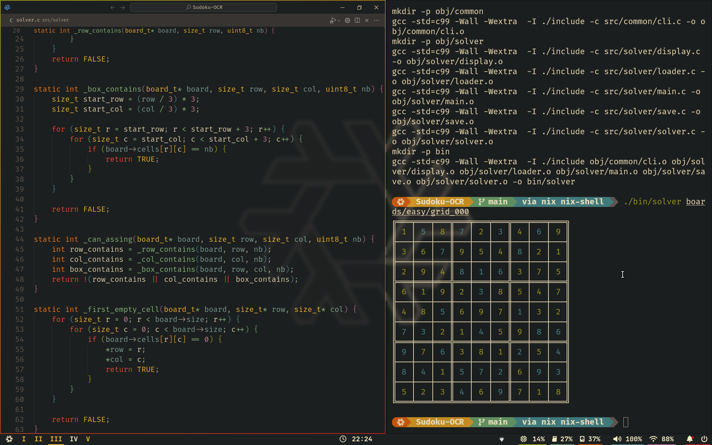
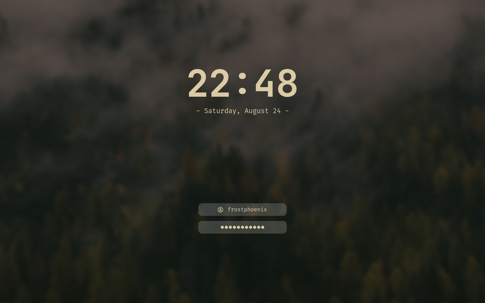

# dotfiles

Ansible-managed dotfiles for Ubuntu, Arch, NixOS, macOS, and Windows.

<p align="center">
    <br>
   
</p>

## Architecture

```
 curl bootstrap ──> bin/dotfiles
                        │
          ┌─────────────┼─────────────────┐
          ▼             ▼                  ▼
    OS Detection    Install Ansible    Clone Repo
          │             │                  │
          └─────────────┼──────────────────┘
                        ▼
               ansible-playbook main.yml
                        │
          ┌─────────────┼──────────────┐
          ▼             ▼              ▼
      pre_tasks/    group_vars/    roles/ (78)
     (detect OS,     all.yml      (each role =
      detect user)  (config)      one tool/app)
          │
          ├── Ubuntu/Debian ──> apt + roles
          ├── Arch ──────────> pacman + roles
          ├── NixOS ─────────> neovim + bash roles ──> nixos-config/install.sh
          ├── macOS ─────────> brew + roles + nix/darwin/
          └── Windows ───────> winget + uv + komorebi (win/)
```

## Install

```bash
bash -c "$(curl -fsSL https://raw.githubusercontent.com/valiantlynx/dotfiles/main/bin/dotfiles)"
```

Run specific roles only:
```bash
dotfiles -t bash,neovim,git
```

Update later:
```bash
dotfiles
```

## What's Included

### Active Roles (default)

| Category | Tools |
|---|---|
| Shell | bash (oh-my-bash), pwsh |
| Terminal | ghostty |
| Editor | neovim (kickstart), vscode |
| VCS | git, lazygit |
| Files | yazi, lsd |
| Browser | vivaldi, chromium |
| Monitor | btop, nvtop |
| Containers | docker |
| Packages | flatpak, nala, nvm, uv |
| CLI Tools | bat, fzf, zoxide, lua, ssh, sshfs, tmux |
| Desktop (Wayland) | hyprland, waybar, rofi, swaync, swayosd, swww, iio-hyprland |
| GPU | nvidia |
| Network | eduvpn, bluetooth |
| Apps | blender, gimp, logseq |
| Fonts | fonts, nerdfont |
| System | system (jq, unzip, curl, etc.) |

### Disabled Roles (uncomment in `group_vars/all.yml`)

1password, alacritty, arduino, asciiquarium, godot, go, helm, k8s, k9s,
kitty, npm, ruby, rust, spotify, terraform, tldr, tmate, unity,
unrealengine, waypaper, zellij, ros2

### NixOS

Full NixOS config lives in `nixos-config/` with Nix flakes + home-manager.
Supports 3 hosts: `desktop`, `laptop`, `vm`.

### macOS

Uses Homebrew + Ansible roles. Optional nix-darwin flake in `nix/darwin/`.

### Windows

Komorebi tiling WM config in `win/`. WSL support via the main Ansible playbook.

## Configuration

Edit `group_vars/all.yml`:

```yaml
# Required
git_user_name: "you"
git_user_email: "you@example.com"

# Optional
exclude_roles: [blender, gimp]        # skip roles
bash_public:                           # -> ~/.bash_public
  MY_VAR: value
bash_private:                          # -> ~/.bash_private (use ansible-vault)
  SECRET: !vault |
    $ANSIBLE_VAULT;1.1;AES256 ...
ssh_key:                               # -> ~/.ssh/<filename>
  id_ed25519: !vault |
    $ANSIBLE_VAULT;1.1;AES256 ...
system_host:                           # -> /etc/hosts
  127.0.0.1: myapp.localhost
```

### Ansible Vault

```bash
mkdir -p ~/.ansible-vault
echo 'your-password' > ~/.ansible-vault/vault.secret
ansible-vault encrypt_string --vault-password-file ~/.ansible-vault/vault.secret "secret" --name "KEY"
```

Auto-detected by `dotfiles` command at runtime.

## Repo Structure

```
.dotfiles/
├── bin/dotfiles          # bootstrap + update script
├── main.yml              # ansible playbook entrypoint
├── ansible.cfg
├── group_vars/all.yml    # config values + role selection
├── pre_tasks/            # OS/user detection
├── requirements/         # ansible-galaxy deps
├── roles/                # 78 ansible roles (one per tool)
│   ├── bash/             #   each has tasks/, files/, templates/
│   ├── neovim/
│   ├── git/
│   └── ...
├── nixos-config/         # full NixOS flake config
│   ├── flake.nix
│   ├── hosts/            #   desktop, laptop, vm
│   ├── modules/          #   core/ + home/
│   └── wallpapers/
├── nix/darwin/           # macOS nix-darwin flake
├── win/                  # Windows komorebi config
└── callback_plugins/     # custom ansible output plugin
```

## Testing

```bash
docker run --rm -it ubuntu bash
apt-get update && apt-get upgrade -y && apt-get install sudo curl -y
bash -c "$(curl -fsSL https://raw.githubusercontent.com/valiantlynx/dotfiles/main/bin/dotfiles)"
```
